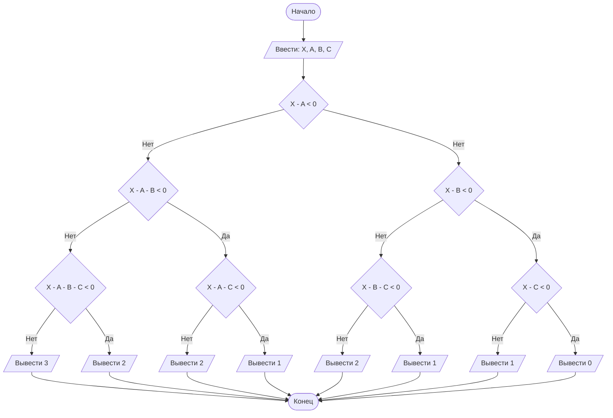

## Отчет по лабораторной работе № 1

#### № группы: `ПМ-2502`

#### Выполнил: `Зубов Константин Олегович`

#### Вариант: `7`

### Cодержание:

- [Постановка задачи](#1-постановка-задачи)
- [Входные и выходные данные](#2-входные-и-выходные-данные)
- [Выбор структуры данных](#3-выбор-структуры-данных)
- [Алгоритм](#4-алгоритм)
- [Программа](#5-программа)
- [Анализ правильности решения](#6-анализ-правильности-решения)

### 1. Постановка задачи

> Три покупателя стоят в очереди за бананами. Они планируют купить A, B,
>C килограмм бананов соответственно порядку в очереди. Если к моменту,
>когда приходит его очередь, в магазине не остаётся нужного покупателю
>количества бананов, покупатель уходит, ничего не купив. Изначально в магазине имеется X кг бананов. Сколько покупателей 
>смогут купить бананы,
>которые они планируют? На вход программы подаются натуральные числа
>X, A, B, C.

Эту задачу можно разделить на 3 основных пункта: сможет ли первый покупатель совершить покупку, сможет ли второй 
покупатель совершить покупку, сможет ли третий покупатель совершить покупку.

- Если у первого покупателя завышенный запрос и в магазине нету достаточно килограмм бананов он уйдет и в магазине 
будет уже два покупателя. Далее мы проверяем хватит ли бананов для второго покупателя:
    1. Если у второго покупателя завышенный запрос и в магазине нету достаточно килограмм бананов он уйдет и в магазине 
останется всего один покупатель покупателя. Если и для него нехватает бананов значит никто не сможет сделать покупку. 
Если же на последнего покупателя хватает бананов, то всего один покупатель покупает бананы.
    2. Если же в магазине хватает бананов на второго покупателя, то мы проверяем хватит ли бананов на второго и третьего
покупателей: если да, то бананами смогут закупиться два покупателя, в противном случае только один.

- Однако если для первого покупателя хватает бананов, то мы проверяем хватит ли их для первого со вторым:
    1. Если хватает, то также проверим хватит ли бананов на первого, второго и третьего, если да, то три покупателя 
смогут купить бананы, в противном случае только двое.
    2. Если не хватает, то проверим хватит ли бананов на первого и третьего, если да, то два покупателя смогут купить 
бананы, если нет, то только один.

### 2. Входные и выходные данные

#### Данные на вход

На вход программа должна получать 4 числа, при этом в условии не сказано, к какому множеству
принадлежать получаемые числа, поэтому будем считать их вещественными. Так как мы говорим о килограммах, то получаемые 
числа не могут быть отрицательными.

|             | Тип                | min значение |
|-------------|--------------------|--------------|
| X (Число 1) | Вещественное число | 0            |
| A (Число 2) | Вещественное число | 0            |
| B (Число 3) | Вещественное число | 0            |
| C (Число 4) | Вещественное число | 0            |

#### Данные на выход

Т.к. программа должна вывести количество покупателей, то выходные данные это целое число ограниченное на промежутке [0;3]

|         | Тип                 | min значение | max значение |
|---------|---------------------|--------------|--------------|
| Число 1 | Целочисленное число | 0            | 3            |

### 3. Выбор структуры данных

Программа получает 4 вещественных числа. Поэтому для их хранения можно выделить 4 переменных (`X`, `A`, `B`, `C`) типа 
`double`.

|             | название переменной | Тип (в Java) | 
|-------------|---------------------|--------------|
| X (Число 1) | `X`                 | `double`     |
| A (Число 2) | `A`                 | `double`     | 
| B (Число 3) | `B`                 | `double`     | 
| C (Число 4) | `C`                 | `double`     | 

Для вывода результата необязательно его хранить в отдельной переменной.

### 4. Алгоритм

#### Алгоритм выполнения программы:

1. **Ввод данных:**  
   Программа считывает четыре вещественных числа, обозначенные как `X`, `A`, `B` и `C`.

2. **Проверка на возможность покупки**  
   Программа смотрит превышает ли запрос первого покупателя количество продукта `X - A < 0`, если да, то аналогично 
проверяем для второго и третьего покупателя. Далее алгоритм проверяет случаи хватит ли товара для всех покупателей 
вместе, для второго и третьего, первого и третьего.

3. **Вывод результата:**  
   На экран выводится количество покупателей, которые смогут совершить покупку.

#### Блок-схема



### 5. Программа

```java
import java.util.Scanner;
import java.io.PrintStream;


public class Main {
    public static Scanner in = new Scanner(System.in);
    public static PrintStream out = new PrintStream(System.out);

    public static void main(String[] args) {
        double X = in.nextDouble(), A = in.nextDouble(), B = in.nextDouble(), C = in.nextDouble();

        if (X - A < 0) {
            if (X - B < 0) {
                if (X - C < 0){
                    out.println(0);
                }

                else {
                    out.println(1);
                }
            }

            else {
                if (X - B - C < 0) {
                    out.println(1);
                }

                else {
                    out.println(2);
                }
            }
        }

        else {
            if (X - A - B < 0) {
                if (X - A - C < 0) {
                    out.println(1);
                }

                else {
                    out.println(2);
                }
            }

            else {
                if (X - A - B - C < 0) {
                    out.println(2);
                }

                else {
                    out.println(3);
                }
            }
        }
    }
}
```

### 6. Анализ правильности решения

Программа работает корректно на всем множестве решений с учетом ограничений.

1. Тест на `X - A < 0, X - B < 0, X - C < 0`:

    - **Input**:
        ```
        10 17 18 52
        ```

    - **Output**:
        ```
        0
        ```

2. Тест на `X - A < 0, X - B < 0, X - C >= 0`:

    - **Input**:
        ```
        10 17 18 8
        ```

    - **Output**:
        ```
        1
        ```

3. Тест на `X - A < 0, X - B > 0, X - B - C < 0`:

    - **Input**:
        ```
        52 100 42 11
        ```

    - **Output**:
        ```
        1
        ```

4. Тест на `X - A < 0, X - B > 0, X - B - C >= 0`:

    - **Input**:
        ```
        52 100 42 10
        ```

    - **Output**:
        ```
        2
        ```

5. Тест на `X - A >= 0, X - A - B < 0, X - A - C < 0`:

    - **Input**:
        ```
        52 2 100 100
        ```

    - **Output**:
        ```
        1
        ```

6. Тест на `X - A >= 0, X - A - B < 0, X - A - C >= 0`:

    - **Input**:
        ```
        52 2 100 40
        ```

    - **Output**:
        ```
        2
        ```

7. Тест на `X - A >= 0, X - A - B >= 0, X - A - B - C < 0`:

    - **Input**:
        ```
        52 5 4 100
        ```

    - **Output**:
        ```
        2
        ```

8. Тест на `X - A >= 0, X - A - B >= 0, X - A - B - C >= 0`:

    - **Input**:
        ```
        52 50 1 1
        ```

    - **Output**:
        ```
        3
        ```
